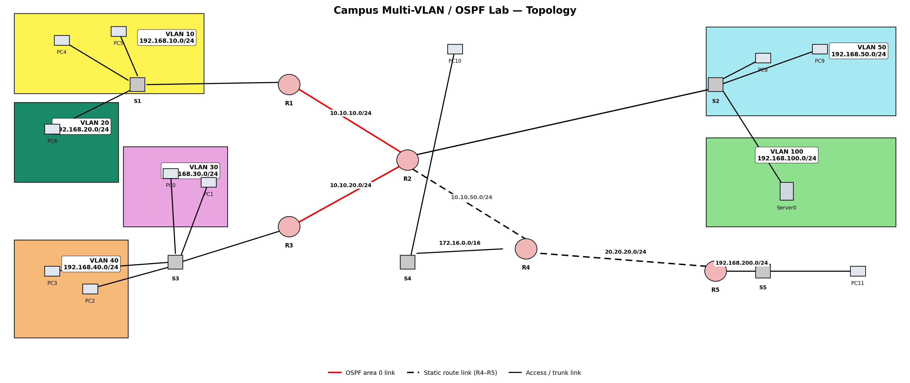

# Campus Multi-VLAN / OSPF Lab

A 5-router, 5-switch, 6-VLAN campus network built in Cisco Packet Tracer
during my bachelor's degree. It covers VLAN segmentation and router-on-a-stick
inter-VLAN routing, OSPF as the core dynamic routing protocol, one deliberate
static-routing island, centralized DHCP with relay across VLANs, and basic
device hardening.



## Where this repo came from

The original Packet Tracer `.pkt` file was lost - all I had left was a
screenshot of the finished topology. This repo rebuilds the full config set
from that image: complete `running-config`-style files for every router and
switch, a redrawn topology diagram, an addressing plan, and a script that
statically validates the configs against each other (subnet math, OSPF
coverage, DHCP relay placement). It does **not** include simulator output
or ping screenshots, since there's no copy of Packet Tracer available to
regenerate those - see [Verification](#verification) below for exactly
what was and wasn't checked, and how to check the rest yourself.

## Requirements (as given for the original assignment)

- Name the routers R1-R5 and the switches S1-S5.
- Set the password `lab123` on the routers.
- Set the password `lab456` on the switches.
- Static routing must be configured between R4 and R5.
- OSPF must be configured on the other routers.
- The DHCP server must assign IP addresses to every computer on the
  network **except** devices connected to the S4 and S5 switches.

## Topology summary

| Segment | Subnet | Switch | Router | Devices |
|---|---|---|---|---|
| VLAN 10 - Sales | 192.168.10.0/24 | S1 | R1 | PC4, PC5 |
| VLAN 20 - IT | 192.168.20.0/24 | S1 | R1 | PC6 |
| VLAN 30 - HR | 192.168.30.0/24 | S3 | R3 | PC0, PC1 |
| VLAN 40 - Finance | 192.168.40.0/24 | S3 | R3 | PC2, PC3 |
| VLAN 50 - Engineering | 192.168.50.0/24 | S2 | R2 | PC8, PC9 |
| VLAN 100 - Servers | 192.168.100.0/24 | S2 | R2 | Server0 (DHCP server) |
| S4 LAN (no DHCP) | 172.16.0.0/16 | S4 | R4 | PC10 |
| S5 LAN (no DHCP) | 192.168.200.0/24 | S5 | R5 | PC11 |

Full link-by-link breakdown, router IDs, and credentials are in
[`docs/addressing-table.md`](docs/addressing-table.md). DHCP pool details
are in [`docs/server0-dhcp-pools.md`](docs/server0-dhcp-pools.md).

## Design decisions

A topology screenshot shows boxes and lines, not interface numbers or
per-port VLAN assignments, so a few things had to be reconstructed with
reasonable, clearly-stated assumptions rather than pulled directly off
the image:

- **S1, S2, S3 are treated as router-on-a-stick trunks.** They're plain
  2960-24TT switches (L2 only), and each hosts two VLANs, so each uplinks
  to its router as an 802.1Q trunk, and the router carries a subinterface
  per VLAN. S4 and S5 are flat access links with no VLAN tagging, since
  they only ever carry one subnet each.
- **R4-R5 static routing, redistributed into OSPF.** The spec says R4-R5
  is static while "the other routers" run OSPF. Taken literally, that
  would strand 192.168.200.0/24 (S5's LAN) - nothing else in the network
  would know how to reach it. The fix: R4 gets a static route to
  192.168.200.0/24 via R5, R5 gets a default static route back via R4,
  and R4 redistributes that static route into OSPF (`redistribute static
  subnets`) so R1/R2/R3 learn about it automatically. The R4-R5 link
  itself never becomes an OSPF adjacency - it's exactly as static as the
  requirement asks for, just not an unreachable island.
- **DHCP relay (`ip helper-address`) on every DHCP-served VLAN
  subinterface**, pointed at Server0 (192.168.100.10). Server0 only sits
  on VLAN 100, so without relay, DHCP broadcasts from any other VLAN would
  never reach it. R4 and R5 intentionally have no helper-address anywhere,
  since PC10 and PC11 are excluded from DHCP by the assignment.
- **Passwords applied to enable secret, console, and VTY** on every
  device (`lab123` for routers, `lab456` for switches), with
  `service password-encryption` on, since "set the password" without
  further detail is most safely read as "make sure you can't get in
  without it" everywhere, not just one line.

## Repo layout

```
campus-multivlan-ospf-lab/
├── topology.png                  # redrawn topology diagram
├── configs/
│   ├── routers/                  # R1.txt - R5.txt, full running-configs
│   └── switches/                 # S1.txt - S5.txt, full running-configs
├── docs/
│   ├── addressing-table.md       # every subnet, link, and credential
│   └── server0-dhcp-pools.md     # DHCP pool setup for the Server-PT device
└── scripts/
    ├── draw_topology.py          # regenerates topology.png
    └── validate_configs.py       # static consistency checks (see below)
```

## Verification

There's no Packet Tracer install available in the environment this repo
was built in, so nothing here was verified by actually loading it into the
simulator and pinging across VLANs - I want to be upfront about that
rather than present unverifiable claims as tested. What *is* verified,
mechanically, by [`scripts/validate_configs.py`](scripts/validate_configs.py):

- Every router-to-router link has matching subnets on both ends, with
  distinct host addresses (`10.10.10.0/24`, `10.10.20.0/24`,
  `10.10.50.0/24`, `20.20.20.0/24`).
- None of the 12 subnets in the addressing plan overlap.
- Every OSPF-eligible interface is actually covered by a `network`
  statement on its router, and the one interface that must stay out of
  OSPF (R4's link to R5) actually does.
- `ip helper-address` is present on exactly the six subinterfaces that
  should relay DHCP, and absent everywhere else (R2's VLAN 100 subinterface,
  since the server is local there, and both of R4/R5's LAN interfaces).
- Every VLAN gateway IP in the configs matches what's documented in
  `docs/addressing-table.md`.

```bash
python3 scripts/validate_configs.py
```

```
RESULT: all consistency checks passed.
```

To actually confirm end-to-end reachability, OSPF neighbor formation, and
DHCP lease behavior, load the configs into Packet Tracer (or GNS3 with IOS
images) by pasting each router/switch file in via `copy running-config
startup-config` after console access, then check:

```
show ip ospf neighbor          " on R1, R2, R3, R4 - should show FULL adjacencies
show ip route                  " on any router - should show O entries for remote VLANs
                                "   and an O E2 entry for 192.168.200.0/24 on R1/R2/R3
ping 192.168.50.11             " from a VLAN 10 PC, after a DHCP lease - cross-VLAN reachability
ipconfig /all                  " on PC4/PC5/PC0/PC1/PC2/PC3/PC8/PC9 - should show a leased
                                "   192.168.x.x address, not APIPA
ipconfig                       " on PC10/PC11 - should show the static address you assigned,
                                "   since neither is served by DHCP
```
